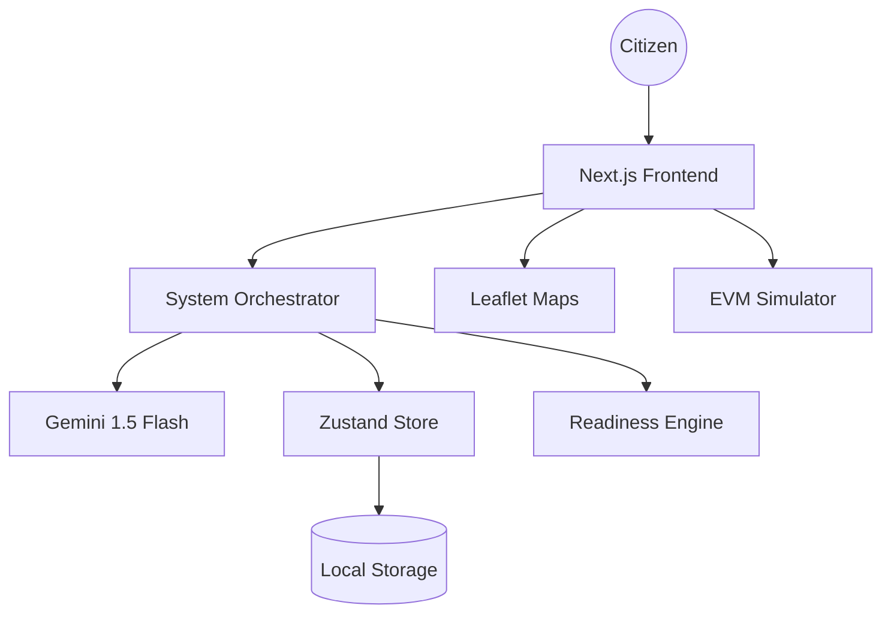
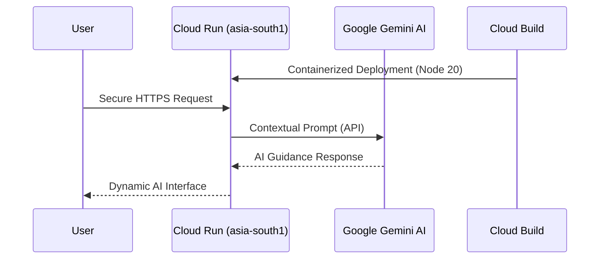

# 🗳️ Civic AI Election Assistant

## 🚀 Overview
**Civic AI Election Assistant** is a smart, multilingual, offline-first platform designed to guide Indian citizens—especially first-time voters—through the entire election process using AI, gamification, and contextual decision-making.

## 🔗 Live Application
The application is deployed on Google Cloud Run and can be accessed at:
**[https://civic-ai-election-assistant-704557478516.asia-south1.run.app](https://civic-ai-election-assistant-704557478516.asia-south1.run.app/)**

## 🏗️ System Architecture

## 🎯 Challenge Vertical
*   **Civic Engagement / Digital Democracy**
*   **Focused Persona**: First-time Indian voters in low-awareness and low-connectivity environments.

## 🧠 Problem Statement
Many citizens, especially first-time voters, struggle with:
*   Understanding election processes
*   Finding polling booths
*   Knowing required documents
*   Staying engaged in civic participation

## 💡 Solution
This system acts as a smart decision engine, guiding users step-by-step using:
*   **AI Assistant**: Context-aware guidance.
*   **Readiness Score**: Quantifiable progress.
*   **Gamified Journey**: Achievement-based flow.
*   **Offline-First**: Reliable accessibility.

## ⚙️ Key Features
*   🤖 **AI Assistant**: Context-aware, multilingual chat using Gemini 1.5 Flash.
*   🧭 **Voting Journey**: Sequential, step-by-step guidance.
*   📊 **Readiness Score**: Logic-based progress engine.
*   🗺️ **Interactive Maps**: Localized booth finders.
*   🧪 **Mock Ballot**: Safe simulation for first-time voters.
*   🎮 **Gamification**: Points, badges, and quizzes.
*   🌐 **Localization**: Support for 8+ Indian languages.
*   ♿ **Accessibility**: Simple and High Contrast modes.

## 🧠 Smart Decision System
The system dynamically calculates:
1.  What the user should do next.
2.  Which critical steps are missing.
3.  How to adapt guidance based on the user's specific profile.

## ☁️ Google Cloud & AI Integration

## 🛠️ Tech Stack
*   **Next.js 16**: (App Router, Turbopack)
*   **Zustand**: Robust, optimized state management.
*   **Framer Motion**: Premium animations.
*   **React Leaflet**: Interactive mapping.
*   **next-intl**: Middleware-based localization.
*   **Google Cloud Run**: Serverless production hosting.

## 🔄 How It Works
1.  **Onboarding**: Select language and set up your voter profile.
2.  **Intelligence**: Dashboard calculates your readiness score immediately.
3.  **Action**: System suggests the most impactful next action.
4.  **Completion**: User completes Quiz, Map, Eligibility, and Mock Ballot.
5.  **Synchronization**: Progress updates dynamically, and the AI assistant provides guidance at every turn.

## 🏁 Conclusion
This project demonstrates how **AI + Gamification + Contextual Logic** can radically improve civic engagement, making voting more accessible, understandable, and empowering for every citizen.

---
**Submission Ready.**